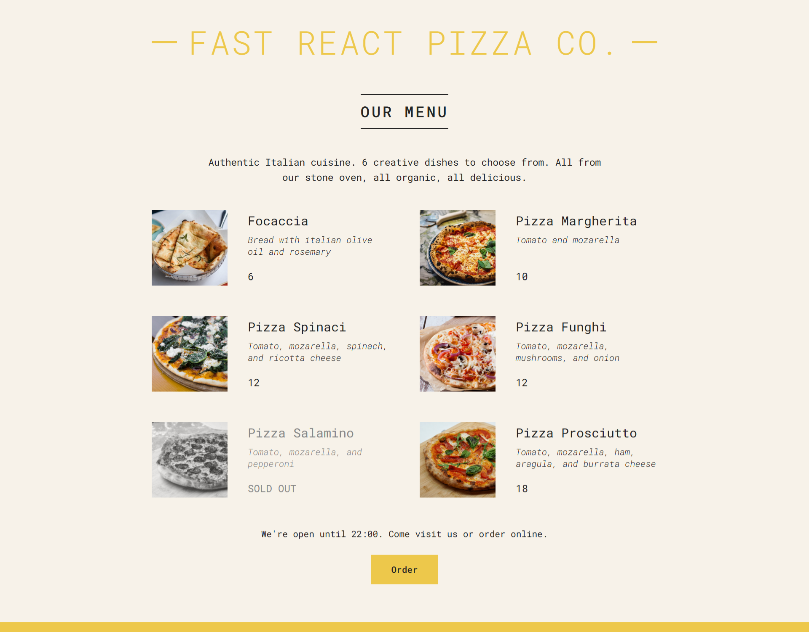
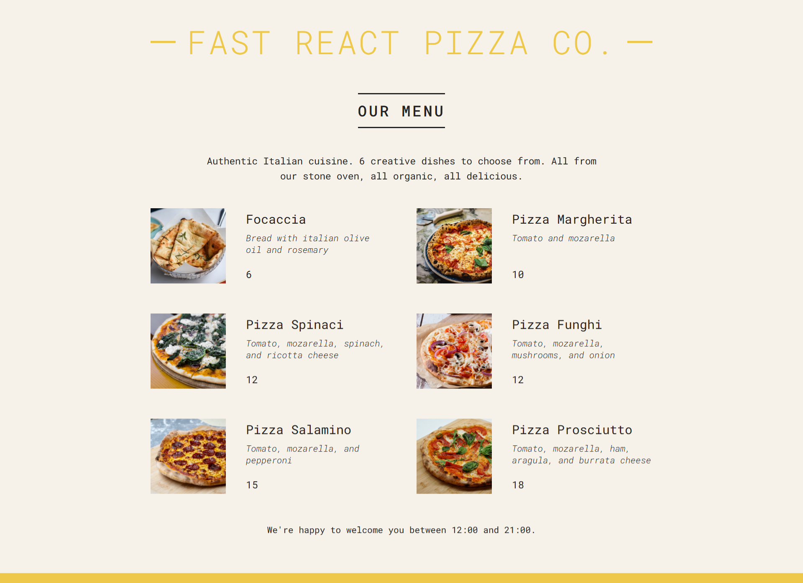
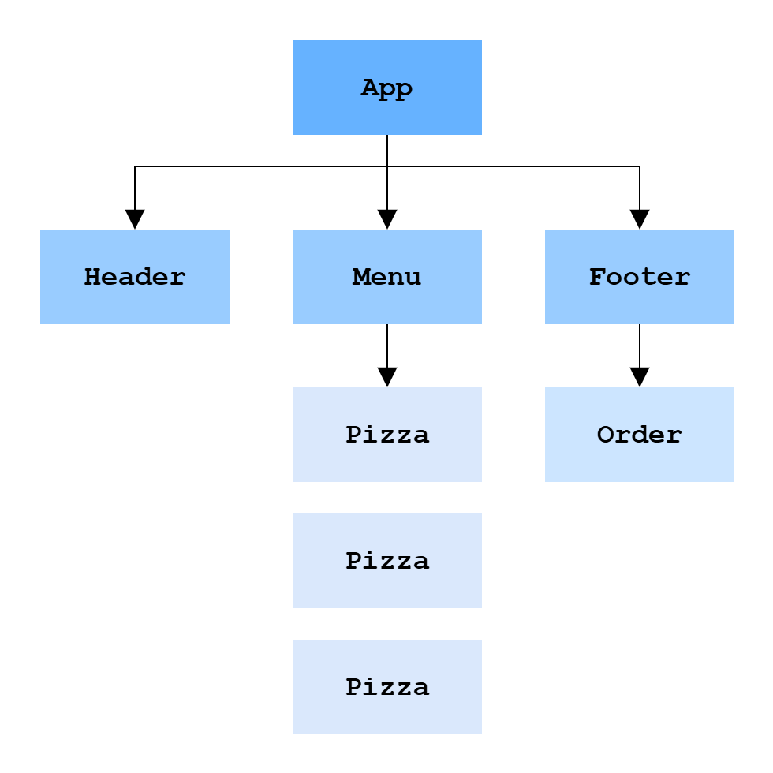

# Pizza Menu

## Description

In this project, I build a pizza menu application using React. The application will display a list of pizzas, their ingredients, prices, and availability. And if a pizza is sold out, it will be indicated accordingly.

At below, you will see a order button that is only available during the restaurant's opening hours (12:00 - 22:00). Therefore, if you visit the page outside of these hours, the order button will not be displayed.

## UI

when the restaurant is open and some pizzas are sold out:

when the restaurant is closed:

## Component tree

